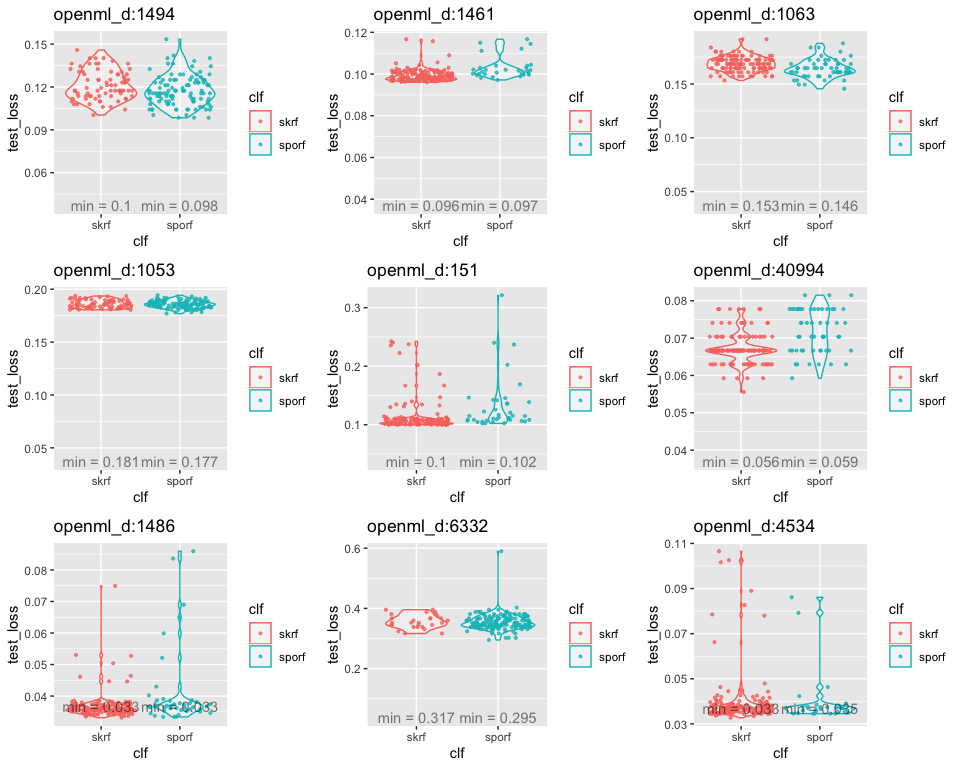
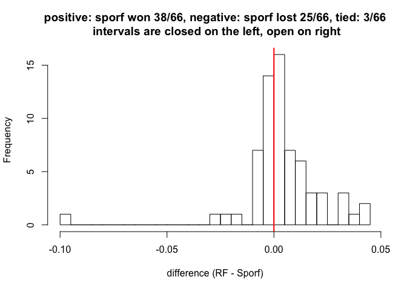
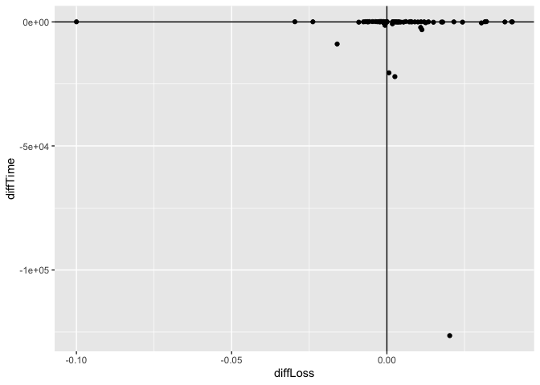

<!--
### ### INITIAL COMMENTS HERE ###
###
### Jesse Leigh Patsolic 
### 2020 <jpatsol1@jhu.edu>
### S.D.G 
#
-->


<style type="text/css">
.table {
    width: 40%;
}
tr:hover {background-color:#f5f5f5;}
</style>

# BOHB results as run on Synaptomes1:

Using the datasets from the [OpenML Study
CC18](https://www.openml.org/s/99) we compare the results of sklearn's
RF and NeuroData's SPORF.  


Each dataset is partitioned into `training`, `validation`, and `testing`
sets.  Using [BOHB via HPBandSter](https://github.com/automl/HpBandSter)
the classifiers are trained on the `training` set and the loss is
calculated on the `validation` set for parameter tuning (BOHB) and the
loss on the `testing` set is reported in the plots and when determining if
SPORF does as well as sklearn's RF.

The hyper-parameter search space is given below:
```
Configuration space object:

Hyperparameters:
  clf, Type: Categorical, Choices: {skrf, sporf}, Default: skrf                                                 
  max_depth, Type: UniformInteger, Range: [2, 65535], Default: 362, on log-scale                                
  max_features_sk, Type: UniformFloat, Range: [0.01, 0.9], Default: 0.455                                       
  max_features_sporf, Type: UniformFloat, Range: [0.01, 4.0], Default: 2.005                                    
  sporf_fc, Type: Categorical, Choices: {1.0, 1.5, 2.0, 2.5, 3.0, 4.0, 8.0}, Default: 1.0                       
Conditions:
  max_features_sk | clf == 'skrf'
  max_features_sporf | clf == 'sporf'
  sporf_fc | clf == 'sporf'

```


```r
dataDir <- "../results_openml_s_99/"

a0 <- dir(dataDir, full.names = TRUE)

f <- grep("csv", a0, value = TRUE)

ids <- as.integer(sapply(f, function(x) strsplit(tail(strsplit(x ,"_")[[1]], 1), ".csv")[[1]]))
names(ids) <- NULL


DAT <- lapply(f, fread)

DAT <- lapply(DAT, function(dat){
	mf1 <- dat$max_features_sporf
	mf2 <- dat$max_features_sk
	mf1[is.na(mf1)]<-mf2[is.na(mf1)]
	dat$mf <- mf1
	dat[, c("V1", "max_features_sk", "max_features_sporf") := NULL]
	dat}
)

for(i in 1:length(DAT)){
	DAT[[i]]$id <- ids[[i]]
}

#suppressWarnings({
#md <- lapply(DAT, melt)
#})

margin <- sapply(DAT, function(dat){ -1*diff(aggregate(dat[, .(test_loss)], list(dat$clf), FUN = min)[, 2]) })

marDiff <- data.table(margin, ids)
```

Using [OpenML Study 99 -- CC18](https://www.openml.org/s/99), the following data IDs were run:

3, 6, 12, 14, 16, 18, 22, 28, 29, 31, 32, 37, 44, 46, 50, 54, 151, 182, 188, 300, 307, 458, 554, 1049, 1050, 1053, 1063, 1067, 1068, 1461, 1464, 1468, 1475, 1478, 1480, 1485, 1486, 1487, 1489, 1494, 1497, 1501, 1510, 1590, 4134, 4534, 4538, 6332, 23381, 23517, 40499, 40668, 40670, 40701, 40923, 40927, 40966, 40975, 40978, 40979, 40982, 40983, 40984, 40994.


## A random sample of runs plotted with jittered violin plots


```r
p <- list()
j <- 1

samp <- sample(length(DAT), 9)

samp <- c(19, samp[-1])

for(i in samp){
#for(i in 1:length(DAT)){
	dat <- DAT[[i]]

	minLoss <- aggregate(dat, list(dat$clf), min)

	poss <- 
		suppressWarnings(
			aggregate(dat, list(dat$clf), median)
		)


	p[[j]] <- 
		ggplot(data = dat, 
					 aes(x = clf, y = test_loss, color = clf, group = clf)) + 
			  geom_violin(alpha = 0.3) + 
			  geom_jitter(size = 0.75, alpha = 0.75, height = 0) +
			  geom_text(data = minLoss, aes(label = paste0("min = ",round(test_loss,3)), y = poss$test_loss), alpha = 0.5, colour = "black") + 
			  ggtitle(paste0("openml_d:", ids[i]))
	j <- j + 1
}

p$ncol = 3
do.call(grid.arrange, p)
```

<!-- -->


|Links_to_datasets                   |
|:-----------------------------------|
|[1494](https://openml.org/d/1494)   |
|[1494](https://openml.org/d/1494)   |
|[1487](https://openml.org/d/1487)   |
|[23517](https://openml.org/d/23517) |
|[1485](https://openml.org/d/1485)   |
|[54](https://openml.org/d/54)       |
|[40499](https://openml.org/d/40499) |
|[44](https://openml.org/d/44)       |
|[31](https://openml.org/d/31)       |


## A histogram showing the differnce in loss, i.e. ((loss(SKRF) - loss(SPORF))


```r
win <- sum(marDiff$margin > 0)
loss <- sum(marDiff$margin < 0)
tie <- sum(marDiff$margin == 0)
tot <- nrow(marDiff)

hist(marDiff$margin,breaks = "fre", 
	 main = sprintf("positive: sporf won %d/%d, negative: sporf lost %d/%d, tied: %d/%d\n intervals are closed on the left, open on right", win, tot, loss, tot, tie, tot), 
	 right = FALSE, xlab = "difference (RF - Sporf)")
abline(v = 0.0, col = 'red', lwd =2)
```



```r
#
#hist(marDiff$margin,breaks = "fre", 
#	 main = "positive: sporf won,\n negative: sporf lost\n intervals are open on the left, closed on right", 
#	 right = TRUE, xlab = "difference (RF - Sporf)")
#abline(v = 0.0, col = 'red', lwd =2)
```

### A different view of the above plot


```r
tmp <- marDiff
tmp$SporfOutcome <- ifelse(tmp$margin < 0, "lost", "won")
tmp$SporfOutcome[tmp$margin == 0] <- "tied"


ai <- ids[ which(tmp$margin > 0.04 | tmp$margin < -0.05) ]
link_id <- sprintf("[%d](%s%d)", ai, "https://openml.org/d/", ai)

colorLegend <- c("darkorange", "black", "darkmagenta")
ggplot(data = tmp, aes(x = 1:length(ids), y = margin, color = SporfOutcome, label = ids)) + geom_point() + 
	geom_text(hjust = 0.01, nudge_x = 0.5, alpha = 0.4) + 
	geom_hline(yintercept = 0, color = 'red', lwd = 0.25) + xlab("") +
	scale_colour_manual(values = colorLegend) + 
	ggtitle("positive: sporf won,\nnegative: sporf lost")
```


|extreme_points                      |
|:-----------------------------------|
|[23381](https://openml.org/d/23381) |
|[307](https://openml.org/d/307)     |
|[54](https://openml.org/d/54)       |


### SPORF Outcome:


```r
table(marDiff$margin >= 0)[2:1]
```

```
## 
##  TRUE FALSE 
##    39    25
```

```r
table(marDiff$margin > 0)[2:1]
```

```
## 
##  TRUE FALSE 
##    36    28
```

## Calculating a $p$-value

Using the parameters the yield the best outcome for each algorithm we
compute the difference $D_i = \min{RF} - \min{SPORF}$.  
Let $n' = n - (\text{number of ties})$, and $\bar{D_i} = \frac{1}{n'}\sum{\mathcal{I}_{D_i > 0}}$


```r
nprime <- length(ids) -  sum(tmp$Spo == 'tied')
q1 <- table(marDiff$margin > 0)[2]
pval <- 1 - pbinom(q = q1, size = nprime, prob = 0.5)
```

## The $p$-value is 0.0618657


---


# Run time comparison:


```r
calcMins <- function(dat){ -1 * (diff(aggregate(dat[, .(run_time)], list(dat$clf), FUN = min)[, 2]))}

red <- data.table(Reduce(rbind, DAT))
#min_loss = min(test_loss), 
sumRuns <- red[, .(min_loss = min(test_loss), sum_time = sum(run_time)), by = .(id,clf)][order(id, -clf)]

diffRuns <- 
	sumRuns[, .(diffLoss = diff(min_loss), diffTime = diff(sum_time)), by = .(id)]

ggplot(data = diffRuns, aes(x = diffLoss, y = diffTime, label = id)) + geom_point() + 
	geom_hline(yintercept = 0) + 
	geom_vline(xintercept = 0)
```

<!-- -->


## Contingency Table


```r
kable(
(g1 <- table(Time = diffRuns$diffTime < 0, Loss = diffRuns$diffLoss > 0))
)
```

         FALSE   TRUE
------  ------  -----
FALSE       21     12
TRUE         7     24

The diagonal reads `sklearn` won on time and loss 21 times (including ties), and `sporf` won on time and loss 24 times.


<!--
#   Time:
##  Working status:
### Comments:
####Soli Deo Gloria
--> 

