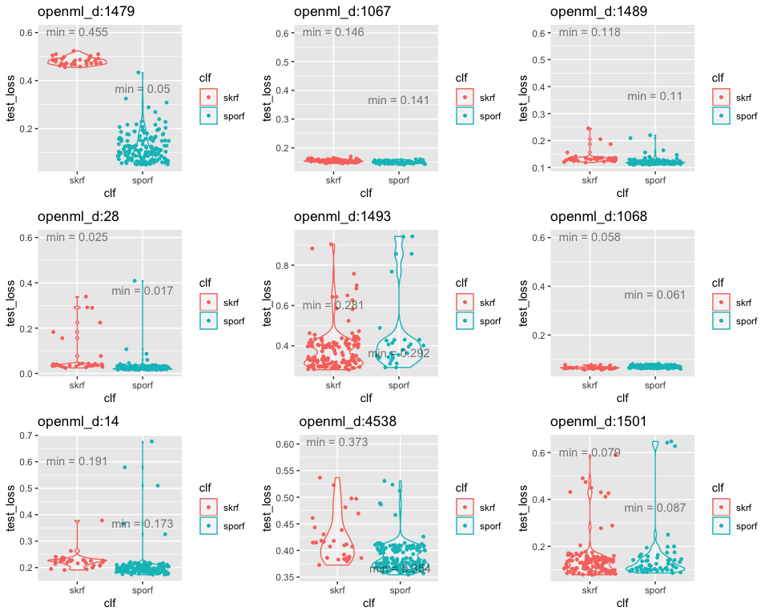
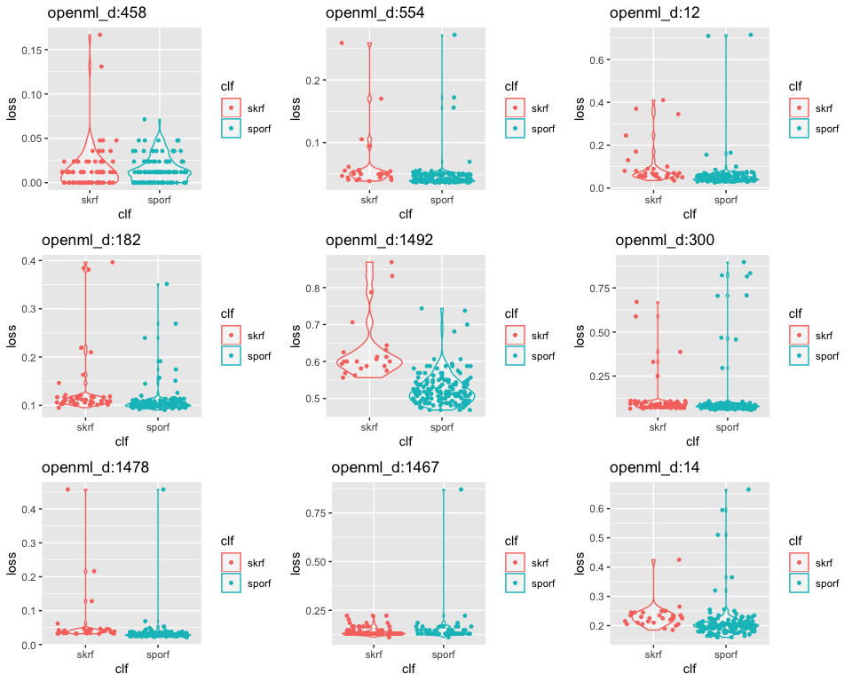
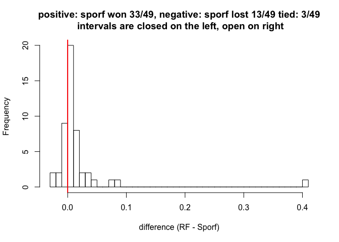

<!--
### ### INITIAL COMMENTS HERE ###
###
### Jesse Leigh Patsolic 
### 2019 <jpatsol1@jhu.edu>
### S.D.G 
#
-->


<style type="text/css">
.table {
    width: 40%;
}
tr:hover {background-color:#f5f5f5;}
</style>


## BOHB results as run on Synaptomes 1:


```r
dataDir <- "../results_openml_s_225/output_syn1"


a0 <- dir(dataDir, full.names = TRUE)

f <- grep("csv", a0, value = TRUE)

ids <- as.integer(sapply(f, function(x) strsplit(tail(strsplit(x ,"_")[[1]], 1), ".csv")[[1]]))
names(ids) <- NULL

DAT <- lapply(f, fread)

DAT <- lapply(DAT, function(dat){
	mf1 <- dat$max_features_sporf
	mf2 <- dat$max_features_sk
	mf1[is.na(mf1)]<-mf2[is.na(mf1)]
	dat$mf <- mf1
	dat[, c("V1", "max_features_sk", "max_features_sporf") := NULL]
	dat}
)

suppressWarnings({
md <- lapply(DAT, melt)
})

margin <- sapply(DAT, function(dat){ -1*diff(aggregate(dat[, .(loss)], list(dat$clf), FUN = min)[, 2]) })

marDiff <- data.table(margin, ids)
```


```r
p <- list()
j <- 1
for(i in sample(length(DAT), 9)){
	dat <- DAT[[i]]

	p[[j]] <- 
		ggplot(data = dat, 
					 aes(x = clf, y = loss, color = clf, group = clf)) + 
			  geom_violin(alpha = 0.3) + 
			  geom_jitter(size = max(dat$budget/max(dat$budget),0.1), height = 0) +
			  ggtitle(paste0("openml_d:", ids[i]))
	j <- j + 1
}

p$ncol = 3
do.call(grid.arrange, p)
```

<!-- -->


```r
hist(marDiff$margin,breaks = "fre", main = "positive: sporf won,\n negative: sporf lost", right = FALSE, xlab = "difference (RF - Sporf)", xlim = c(-0.1,.5))
abline(v = 0.0, col = 'red', lwd =2)
```

<!-- -->


```r
ggplot(data = marDiff, aes(x = 1:length(ids), y = margin)) + geom_point() + 
	geom_hline(yintercept = 0, color = 'red', lwd = 0.25)
```

<!-- -->

### SPORF won:


```r
table(marDiff$margin >= 0)[2:1]
```

```
## 
##  TRUE FALSE 
##    41    13
```

---


<!--
#   Time:
##  Working status:
### Comments:
####Soli Deo Gloria
--> 

